# DocuProof - Implementation Guide

## 🎯 Overview

DocuProof is a professional AI-powered document analysis system that provides comprehensive proofreading, consistency checking, and writing improvement suggestions. This guide explains the technical architecture and implementation details.

## 📋 System Architecture

### Core Technologies
- **Frontend**: Next.js 15 with App Router, React 19, TypeScript
- **Authentication**: Firebase Auth with Google Sign-in
- **Database**: Firestore for document and analysis storage  
- **AI Engine**: Upstage Solar LLM (solar-pro2) with reasoning_effort: "high"
- **Document Processing**: Upstage Document Digitization API
- **UI Components**: Radix UI primitives with Tailwind CSS
- **Text Processing**: Professional `diff` library for change tracking

## 🔄 Document Analysis Flow

```mermaid
graph TD
    A["Document Analysis Request"] --> B["Get Full Document Text"]
    B --> C["Process Each Chunk"]
    
    C --> D["Enhanced LLM Prompt with XML Tags"]
    
    D --> E["<chapter_to_work_on><br/>Current chunk content<br/></chapter_to_work_on>"]
    D --> F["<entire_context><br/>Full document text<br/></entire_context>"]
    
    E --> G["Solar LLM Analysis"]
    F --> G
    
    G --> H["JSON Response with<br/>Modified/Suggested Version"]
    
    I["Key Benefits"] --> J["✅ Clear separation of chunk vs context<br/>✅ XML tags for LLM clarity<br/>✅ Full document context maintained<br/>✅ Simple, robust approach<br/>✅ Better LLM understanding"]
    
    K["Before: Plain Text"] --> L["FULL DOCUMENT CONTEXT:<br/>...<br/>SECTION TO ANALYZE:<br/>..."]
    
    M["After: XML Tagged"] --> N["<chapter_to_work_on><br/>...<br/></chapter_to_work_on><br/><entire_context><br/>...<br/></entire_context>"]
    
    style E fill:#e8f5e8
    style F fill:#e3f2fd
    style J fill:#f0f9ff
    style N fill:#e8f5e8
```

### Context-Aware Analysis
The system passes **full document context** to the LLM for each chunk analysis to ensure consistency across the entire document. The XML-tagged prompt structure provides clear separation between:
- `<chapter_to_work_on>`: The specific section to be improved
- `<entire_context>`: Full document for consistency reference

## ⚙️ Three-Tier Analysis System

```mermaid
graph TD
    A["User Selects Analysis Level"] --> B["Minor"]
    A --> C["Medium"] 
    A --> D["Major"]
    
    B --> B1["CONSERVATIVE<br/>• Basic proofreading<br/>• Fix errors & gaps<br/>• Minimal changes<br/>• Preserve structure"]
    
    C --> C1["BALANCED<br/>• Comprehensive editing<br/>• Improve style & flow<br/>• Moderate rewriting<br/>• Enhance engagement"]
    
    D --> D1["AGGRESSIVE<br/>• Complete transformation<br/>• Dramatic rewriting<br/>• Length flexibility<br/>• World-class writing"]
    
    B1 --> E["Solar LLM Prompt"]
    C1 --> E
    D1 --> E
    
    E --> F["Key Prompt Changes:<br/>❌ PRESERVE content length<br/>❌ Conservative deletion policy<br/>✅ Level-specific instructions<br/>✅ 'Don't hold back' for Major<br/>✅ 'Dramatically better' requirement"]
    
    style B fill:#e8f5e8
    style C fill:#e3f2fd  
    style D fill:#f3e5f5
    style F fill:#fff3e0
```

### Analysis Level Details

**Minor Level:**
- Basic proofreading and error correction
- Minimal changes while maintaining original voice
- Focus on grammar, spelling, consistency

**Medium Level:**
- Comprehensive editing with style improvements  
- Moderate restructuring for better flow
- Enhanced clarity and engagement

**Major Level:**
- Aggressive rewriting and restructuring
- Complete transformation for maximum impact
- World-class writing quality with dramatic improvements

## 🎨 Professional Favicon System

```mermaid
graph TD
    A["DocuProof Favicon System"] --> B["Light Theme<br/>favicon.svg"]
    A --> C["Dark Theme<br/>favicon-dark.svg"] 
    A --> D["Small Size<br/>icon-16.svg"]
    
    B --> B1["📄 White document<br/>✏️ Red correction line<br/>✅ Green checkmark<br/>Gray text lines"]
    
    C --> C1["📄 Dark document on dark bg<br/>✏️ Red correction line<br/>✅ Green checkmark<br/>Light text lines"]
    
    D --> D1["📄 Simplified 16x16<br/>Essential elements only<br/>Crisp at small size"]
    
    B1 --> E["Browser Tab Visibility"]
    C1 --> E
    D1 --> E
    
    E --> F["✅ Automatic theme detection<br/>✅ Multiple size support<br/>✅ Apple Touch icon<br/>✅ Professional appearance"]
    
    style A fill:#f0f9ff
    style B fill:#f0fdf4
    style C fill:#1f2937,color:#ffffff
    style D fill:#fef3c7
    style F fill:#dcfce7
```

### Favicon Implementation
- **favicon.svg** (32x32): Light theme with document + checkmark design
- **favicon-dark.svg** (32x32): Dark theme optimized version
- **icon-16.svg** (16x16): Simplified design for small displays
- Automatic theme detection via CSS media queries
- Apple Touch icon support for mobile bookmarks

## 📝 Minimal Text Rendering Pipeline

```mermaid
graph TD
    A["HTML Text Input"] --> B["htmlToMinimalText()"]
    
    B --> C["HTML Element Conversion"]
    B --> D["HTML Entity Conversion"] 
    B --> E["Whitespace Cleanup"]
    
    C --> C1["br tags to newlines<br/>p/div tags to newlines<br/>h1-h6 tags to newlines"]
    D --> D1["&nbsp; to space<br/>&amp; to &<br/>&lt; to <<br/>&gt; to ><br/>&quot; to quote"]
    E --> E1["Multiple spaces to single<br/>Multiple newlines to double<br/>Trim whitespace"]
    
    C1 --> F["renderMinimalText()"]
    D1 --> F
    E1 --> F
    
    F --> G["JSX with whiteSpace: pre-wrap"]
    G --> H["Diff Viewer Display"]
    
    I["Benefits"] --> J["Line breaks preserved<br/>Copy-paste friendly<br/>Clean diff comparisons<br/>Better readability"]
    
    F --> K["Updated Components"]
    K --> L["✅ Inline diff rendering<br/>✅ Clean version display<br/>✅ Clipboard copy function<br/>✅ Text comparison filters"]
    
    style A fill:#ffebee
    style H fill:#e8f5e8
    style J fill:#e3f2fd
    style L fill:#f0f9ff
```

### Text Processing Features
- Converts HTML elements to clean text (` ` → `\n`, etc.)
- Preserves line breaks and formatting
- Clean clipboard copy functionality
- Accurate text comparisons without HTML interference

## 🔧 Professional Diff System

```mermaid
graph TD
    A["Original Text:<br/>좋은 프린터에 수준에 필적하는 성능을"] --> B["diff library<br/>diffWords()"]
    C["Suggested Text:<br/>좋은 프린터의 수준에 필적하는 성능을"] --> B
    
    B --> D["Professional Diff Result:<br/>{value: '좋은 ', added: false, removed: false}<br/>{value: '프린터에', added: false, removed: true}<br/>{value: '프린터의', added: true, removed: false}<br/>{value: ' 수준에 필적하는 성능을', added: false, removed: false}"]
    
    D --> E["React JSX Output:<br/><span>좋은 </span><br/><span class='deleted'>프린터에</span><br/><span class='added'>프린터의</span><br/><span> 수준에 필적하는 성능을</span>"]
    
    E --> F["Final Display:<br/>좋은 <strike>프린터에</strike><green>프린터의</green> 수준에 필적하는 성능을"]
    
    style A fill:#ffebee
    style C fill:#e8f5e8
    style F fill:#e3f2fd
    style B fill:#fff3e0
```

### Diff Implementation
- Uses industry-standard `diff` library (same as Git, VS Code)
- Word-level precision highlighting
- Myers diff algorithm for optimal change detection
- Professional track-changes appearance

## 🔄 Shared Document View Evolution

```mermaid
graph TB
    A["BEFORE: Shared Document View"] --> B["Side-by-side comparison<br/>Original vs Suggested columns<br/>Separate suggestion cards<br/>Basic text display<br/>No copy functionality"]
    
    C["AFTER: Updated Shared View"] --> D["✅ Inline diff with track changes<br/>✅ Professional diff library<br/>✅ Minimal text rendering<br/>✅ Copy-paste functionality<br/>✅ Clean version display<br/>✅ Summary of improvements"]
    
    E["Main Analysis View"] --> F["Same Components Reused"]
    F --> G["htmlToMinimalText()<br/>renderMinimalText()<br/>createInlineTrackChanges()<br/>SectionComparison"]
    
    G --> D
    
    H["Key Improvements"] --> I["🎯 Consistent UI across main and shared views<br/>📝 HTML cleaned to minimal text<br/>🔧 Word-level diff highlighting<br/>📋 One-click copy functionality<br/>✨ Professional appearance<br/>🚫 Filter sections with no real changes"]
    
    style A fill:#ffebee
    style C fill:#e8f5e8
    style D fill:#e8f5e8
    style I fill:#e3f2fd
```

## 📊 Key Implementation Features

### 1. Context-Aware Analysis
- Full document context passed to LLM for consistency checking
- XML-tagged prompts for clear instruction structure
- Semantic chunking (~700 words) with header sensitivity

### 2. Professional UI/UX
- Consistent diff rendering across all views
- Real-time streaming analysis with progress tracking
- Copy-paste friendly text output
- Professional appearance matching enterprise software

### 3. Robust Text Processing
- HTML to minimal text conversion
- Professional diff library integration
- Smart filtering of unchanged sections
- Preserved formatting with proper line breaks

### 4. Multi-Level Analysis
- Three-tier system (Minor, Medium, Major)
- Level-specific LLM prompts and policies
- Aggressive rewriting capabilities for major level
- Conservative approach for minor corrections

## 🛠️ Technical Architecture

### Frontend Components
- `document-analysis.tsx`: Main analysis interface with diff display
- `shared-document.tsx`: Public sharing interface (reuses main components)
- `document-upload.tsx`: File upload with drag-and-drop
- `dashboard-layout.tsx`: Main dashboard with sidebar and document management

### Backend APIs
- `/api/upload`: Document upload and text extraction using Upstage Document Parser
- `/api/analyze`: Chunk-by-chunk analysis with Solar LLM
- `/api/auth/callback`: Firebase authentication handling

### Data Flow
1. Document upload → Text extraction → Semantic chunking
2. Analysis request → Context-aware LLM prompts → JSON responses
3. Real-time streaming → Diff processing → UI updates

## 🎯 Performance Optimizations
- Semantic text chunking for optimal LLM processing
- Professional diff library for efficient change detection
- Streaming analysis for real-time user feedback
- Smart caching and state management

## 🔒 Security & Authentication
- Firebase Authentication with Google Sign-in
- Server-side token verification
- Secure document storage in Firestore
- Private document access with sharing capabilities

---

*This implementation provides a professional-grade document analysis platform with AI-powered improvements, consistent UI/UX, and enterprise-quality features.* 